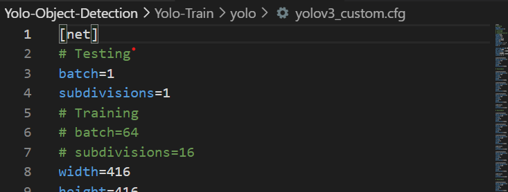

# Training the YOLO(version-3) for custom Data:- 

	
> ## Data-Preparation:
> - Needed to label the images of different objects which you are going to train.
> - Here ['Narendra Modi', 'Barack Obama', 'Shahrukh khan', 'Cristiano Ronaldo'] Are those are we are going to Detect using Yolo.
> - Use https://tzutalin.github.io/labelImg/ this software for labelling the data.
> - Set configuration to Yolo and mark box on the image using this software.


> ## Requirments for custom training:
> - Clone the official darknet repository. `!git clone https://github.com/AlexeyAB/darknet`.
> #### Download pre-trained YOLOv3 weights
> - YOLOv3 has been trained already on the coco dataset which has 80 classes that it can predict. We will grab these pre-trained [weights](https://pjreddie.com/media/files/darknet53.conv.74) so that we can run YOLOv3 on these pre-trained classes and get detections.


> ## Custom Configuration of darknet:
> #### 1. Config  File:-
> - Copy over the yolov3.cfg to edit **"darknet/cfg/yolov3.cfg"** make copy as **"yolov3_custom.cfg"**.
> - Open  **"yolov3_custom.cfg"** comment testing and swwitch to training.
>
>    > - [ 6] batch=64
>     > - [ 7] subdivisions=16
>    > - [ 20] max_batches = 8000 ( max_batches => no of classes x 2000 => 4*2000 =8000 )
>    > - [610 ] classes=4 **{No of classes you are detectiing in this case it is 4}**
>     > - [603 ] filters=27 { **filter=> (classes+5)x3** = (4+5)*3 =>27  }
>    > - [696] classes=4 
>     > - [689] filters=27
>    > - [783] classes=4 
>    > - [776] filters=27 
>
>
> #### 2. Makefile:-
> -  Open Make file and make changes.
>  - [ ] GPU=1
>  - [ ] CUDNN=1
>  - [ ] OPENCV=1

> ## Prepare Data for training Ready:
> - In Data folder having all images and txt's.
> - Create a new file within a code or text editor called  **classes.names**  and you will make this file exactly the same as your classes.txt in the dataset generation step.
> - Use **creating-files-data-and-name.py** and **creating-train-and-test-txt-files.py** to create data[lablled.data].
> - Make sure these are in same folder Data.
> > #### Generating train.txt
> > - The last configuration file needed before we can begin to train our custom detector is the train.txt file which hold the relative paths to all our training images.
> > ``` python 
>  >from  glob  import  glob  
>  >imgs_list  =  glob("Data/*jpg")  
>  >file  =  open("Data/train.txt",'w') 
 >  >file.write("\n".join(imgs_list))  
 >  >file.close()


>## Steps for training: 
>	
>
>  >#### 1. Folder Structure:- 
>	>	├── darknet        
>	>	├── Data             
>	>	├── coustom_weights       (Conntaining  pretrained weights) 
>	>	├── backup              		  ( empty initilized folder)
>	>	└── README.md
>
> >#### 2.  Make the YOLO file using the make command **Make sure you are into darknet folder**:-
> >
>  >`%cd darknet/`
>  >`!make` 
>  >
>  > **"!make"** will create a ready to go configured algorithm according to the system requirement available and able to create the model.
>  >
>  
>  >#### 3. Unblock/premission to darknet command:-
>  > `!chmod +x ./darknet`
>  >
>  > It will activate permission to darknet built.
>  
>  > #### 4. Start Training :-
>  > Get to main working directery using `%cd ..` 
>  >
>  > Use the below command to start training.
>  >
>  >`!darknet/darknet detector train Data/labelled_data.data darknet/cfg/yolov3_custom.cfg Custom_weights/darknet53.conv.74 -dont_show`
>  >
>  > It will start the training of your custom model and takes 2-3 hours or more depending upon data size.
>   > After training in the backup folder you will get trained weights to use them to detect and testing purpose.
>   >

> ## Runnning  Custom Object Detector!!!
> [obj-detection-opencv.ipynb](obj-detection-opencv.ipynb)
> 
> > 1. Put the custom classes into yolo.txt.
> >
> > 
> 
>  >2. yolov3_custom.cfg change it to training to testing
> > 	Open **"yolov3_custom.cfg"** comment trainig and switch to testing.
> > 
> 
> > 3. Put custom trained [weights](https://drive.google.com/drive/folders/1hnuhcLrEsZ6VQR7bt39FR8zB15LUZp3A?usp=sharing) yolo folder as well .
>
> 
> 